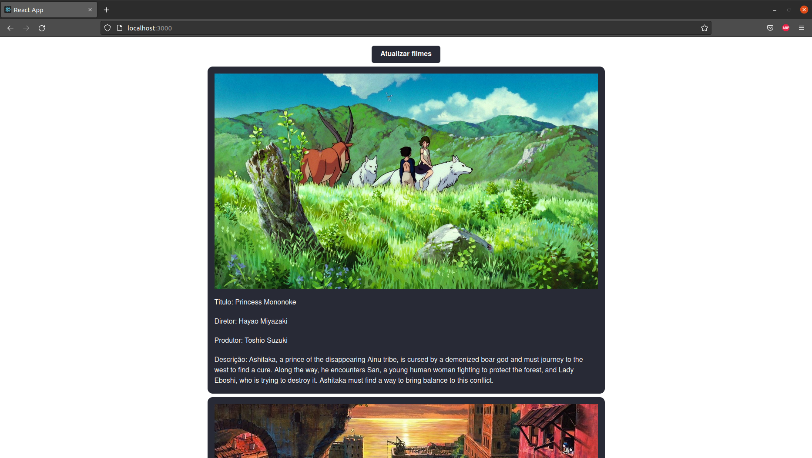
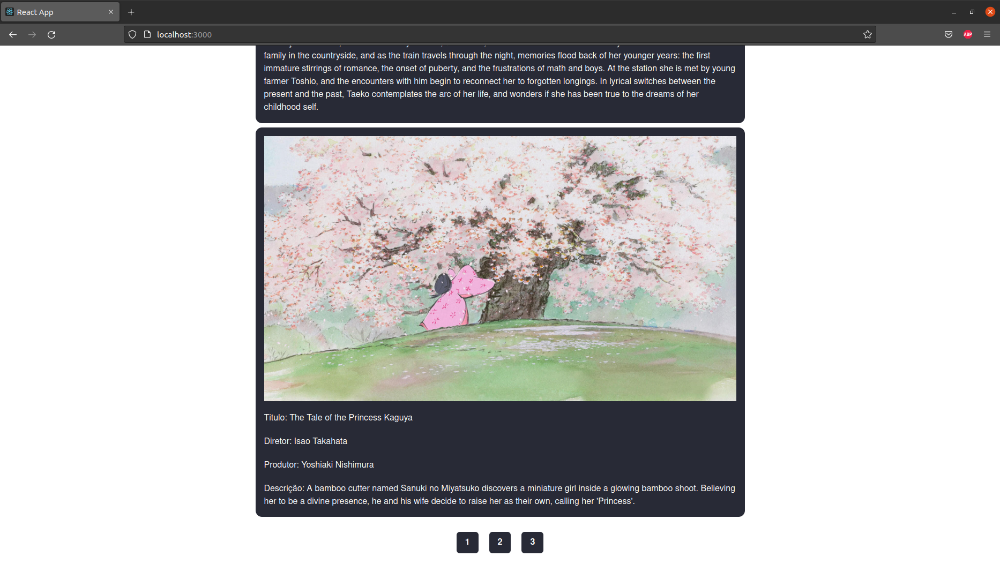

# Passo a passo de como rodar meu projeto

Usei a biblioteca chackra-ui para desenvolver as telas do projeto, infelizmente não tiver um layout referencia do que esperavam de mim, então desenvolvi da minha cabeça

## Configuração do projeto

Você precisa renomear o arquivo ".env.example" para ".env" e logo após isso é preciso configurar a url do back-end

## Instalação das dependências do projeto:
```
yarn
```
## Começando aplicação
```
yarn start
```

## Feedback visual:




